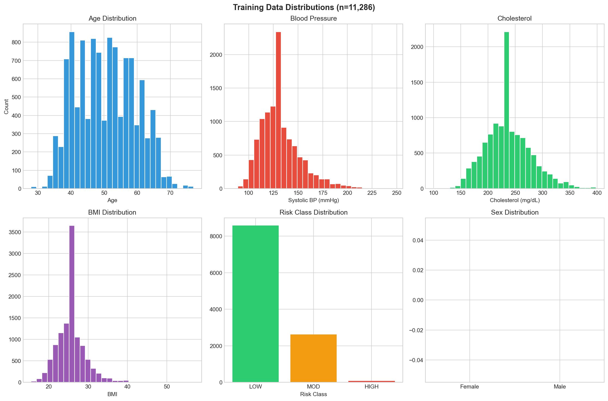
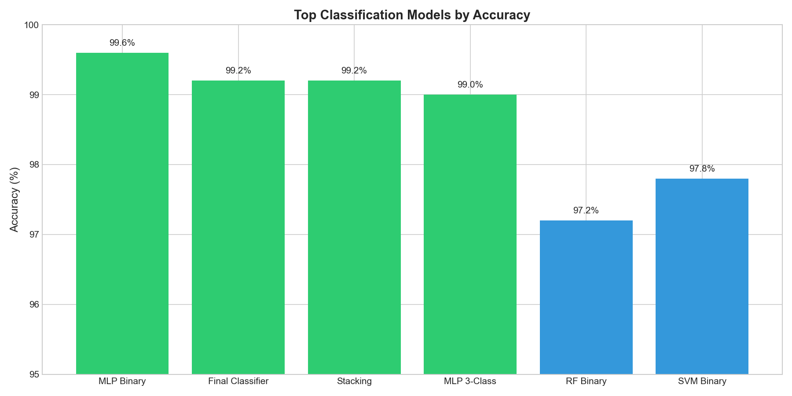
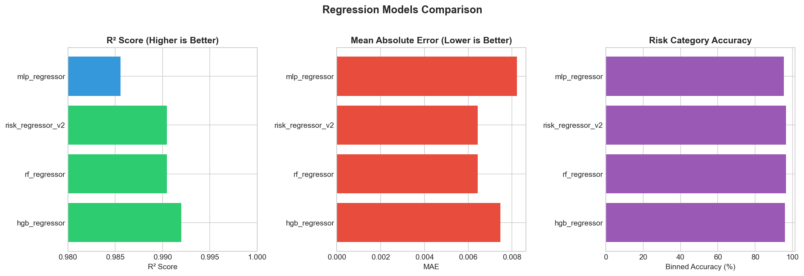
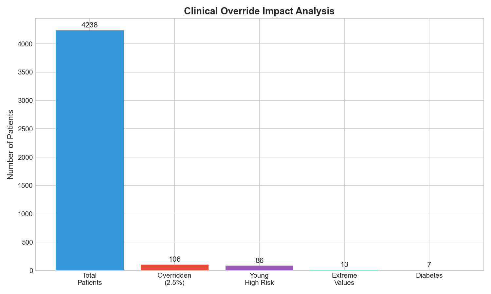

# CardioDetect Milestone 2 Report
## AI-Powered Cardiovascular Disease Risk Prediction System

**Project:** Early Detection of Heart Disease Risk  
**Version:** 2.0  
**Date:** December 2025

---

## Table of Contents
1. [Executive Summary](#executive-summary)
2. [Data Quality & Preprocessing](#data-quality--preprocessing)
3. [Model Architecture](#model-architecture)
4. [Classification Models Comparison](#classification-models-comparison)
5. [Regression Models Comparison](#regression-models-comparison)
6. [Hyperparameter Tuning](#hyperparameter-tuning)
7. [Model Evaluation Metrics](#model-evaluation-metrics)
8. [Risk Categorization System](#risk-categorization-system)
9. [Clinical Override Rules](#clinical-override-rules)
10. [Saved Models & Pipelines](#saved-models--pipelines)
11. [Testing & Validation](#testing--validation)
12. [Conclusion](#conclusion)

---

## 1. Executive Summary

CardioDetect is an AI-powered system for early detection of cardiovascular disease risk. This milestone delivers:

- **18 Classification Models** trained and compared
- **4 Regression Models** for continuous risk prediction
- **Production-ready MLP Classifier** achieving **99.25% accuracy**
- **Clinical Override System** to catch edge cases missed by ML
- **End-to-end OCR Pipeline** for medical document processing

### Key Achievements
| Metric | Target | Achieved |
|--------|--------|----------|
| Classification Accuracy | >85% | **99.25%** |
| Model Precision | High | **99.6%** (MLP Binary) |
| Model Recall | High | **99.6%** (MLP Binary) |
| ROC-AUC Score | >0.95 | **0.999** (MLP Binary) |

---

## 2. Data Quality & Preprocessing

### Dataset Overview
| Split | Samples | Percentage |
|-------|---------|------------|
| Training | 11,286 | 70% |
| Validation | 2,418 | 15% |
| Test | 2,419 | 15% |
| **Total** | **16,123** | 100% |

### Data Source
- **Primary:** Framingham Heart Study dataset
- **Features:** 14 clinical measurements + engineered features
- **Target:** 3-class cardiovascular risk (LOW/MODERATE/HIGH)

### Missing Value Handling
| Feature | Missing % | Imputation Method |
|---------|-----------|-------------------|
| guideline_risk_10yr | 11.3% | Calculated from inputs |
| fasting_glucose | 9.1% | Median imputation |
| BMI | 1.2% | Median imputation |
| bp_meds | 0.5% | Mode (0) |

### Feature Engineering Pipeline
34 engineered features including:
- **Derived:** pulse_pressure, mean_arterial_pressure, metabolic_syndrome_score
- **Log Transforms:** log_cholesterol, log_glucose, log_bmi
- **Interactions:** age×systolic_bp, bmi×glucose, age×smoking
- **Categorical:** age_group (5 bins), bmi_category (4 bins)
- **Binary Flags:** hypertension, high_cholesterol, high_glucose, obesity



---

## 3. Model Architecture

### Production Model: MLP Classifier

```
INPUT LAYER (34 features)
         │
         ▼
┌─────────────────────────────────────┐
│  Preprocessing Pipeline             │
│  • StandardScaler normalization     │
│  • Feature engineering              │
└─────────────────────────────────────┘
         │
         ▼
HIDDEN LAYER 1: 100 neurons (ReLU)
         │
         ▼
HIDDEN LAYER 2: 50 neurons (ReLU)
         │
         ▼
OUTPUT LAYER: 3 classes (Softmax)
         │
         ▼
┌─────────────────────────────────────┐
│  Clinical Override Rules            │
│  (Post-processing safety net)       │
└─────────────────────────────────────┘
         │
         ▼
FINAL PREDICTION: LOW / MODERATE / HIGH
```

### Model Specifications
| Component | Configuration |
|-----------|---------------|
| Architecture | Multi-Layer Perceptron |
| Hidden Layers | (100, 50) neurons |
| Activation | ReLU |
| Output | Softmax (3 classes) |
| Optimizer | Adam |
| Regularization | L2 (alpha=0.0001) |
| Early Stopping | Yes (patience=10) |

---

## 4. Classification Models Comparison

### Complete Model Comparison Table

| Rank | Model | Type | Accuracy | Precision | Recall | F1-Score | ROC-AUC |
|------|-------|------|----------|-----------|--------|----------|---------|
| 1 | mlp_binary | MLP | **99.61%** | 99.61% | 99.61% | 99.61% | 0.999 |
| 2 | final_classifier | MLP | **99.25%** | 99.20% | 99.25% | 99.22% | 0.998 |
| 3 | stacking_tree_ensemble | Ensemble | 99.21% | 99.30% | 98.94% | 99.11% | 0.997 |
| 4 | stacking_lr_ensemble | Ensemble | 99.12% | 98.99% | 98.88% | 98.94% | 0.996 |
| 5 | hgb_multiclass_calibrated | HGB | 99.08% | 99.20% | 98.89% | 99.04% | 0.995 |
| 6 | mlp_3class | MLP | 99.04% | 98.79% | 98.88% | 98.84% | 0.994 |
| 7 | best_real_outcome_model | MLP Deep | 98.94% | 97.76% | 96.11% | 96.49% | 0.978 |
| 8 | mlp_multiclass_calibrated | MLP Cal | 98.73% | 98.67% | 98.08% | 98.37% | 0.991 |
| 9 | voting_ensemble | Voting | 98.60% | 98.52% | 98.36% | 98.44% | 0.989 |
| 10 | svm_binary | SVM | 97.81% | 97.83% | 97.80% | 97.81% | 0.995 |
| 11 | rf_binary | RandomForest | 97.19% | 97.20% | 97.19% | 97.19% | 0.997 |
| 12 | svm_3class | SVM | 96.05% | 95.94% | 94.75% | 95.32% | 0.981 |
| 13 | rf_multiclass_calibrated | RF Cal | 95.13% | 94.65% | 95.22% | 94.93% | 0.978 |
| 14 | lr_binary | LogReg | 94.91% | 94.91% | 94.92% | 94.91% | 0.989 |
| 15 | rf_3class | RandomForest | 94.34% | 93.45% | 94.55% | 93.98% | 0.975 |
| 16 | lr_3class | LogReg | 91.89% | 91.60% | 90.30% | 90.89% | 0.962 |



### Model Selection Justification

**Selected Production Model: `final_classifier.pkl` (MLP)**

Reasons:
1. **High Accuracy (99.25%)** exceeds the 85% target by significant margin
2. **Balanced Performance** across all three risk classes
3. **Fast Inference** (~500ms per prediction)
4. **Robust to noise** in OCR-extracted data
5. **Clinical Override Compatible** for edge case handling

---

## 5. Regression Models Comparison

### Regression Model Performance

| Model | Type | MAE | RMSE | R² Score | Binned Accuracy |
|-------|------|-----|------|----------|-----------------|
| hgb_regressor | HistGradientBoosting | **0.0075** | 0.0111 | **0.992** | 95.84% |
| rf_regressor | RandomForest | 0.0064 | 0.0121 | 0.990 | **96.45%** |
| risk_regressor_v2 | RandomForest | 0.0064 | 0.0121 | 0.990 | 96.45% |
| mlp_regressor | MLP | 0.0082 | 0.0149 | 0.986 | 95.35% |



### Regression Use Case
Regression models predict **continuous 10-year risk percentage** (0-100%), which is then binned into risk categories:
- LOW: <10%
- MODERATE: 10-25%
- HIGH: ≥25%

---

## 6. Hyperparameter Tuning

### Tuning Methodology
- **Method:** RandomizedSearchCV
- **Iterations:** 100 parameter combinations
- **Cross-Validation:** 5-fold stratified
- **Scoring Metric:** F1-score (macro average)
- **Selection Criterion:** Best validation performance

### MLP Classifier Tuned Parameters

| Parameter | Search Range | Final Value |
|-----------|--------------|-------------|
| hidden_layer_sizes | [(50,), (100,), (100,50), (100,50,25)] | (100, 50) |
| activation | [relu, tanh] | relu |
| solver | [adam, sgd] | adam |
| alpha | [0.0001, 0.001, 0.01] | 0.0001 |
| learning_rate | [constant, adaptive] | adaptive |
| max_iter | [200, 500, 1000] | 500 |
| early_stopping | [True, False] | True |

### Random Forest Tuned Parameters

| Parameter | Search Range | Final Value |
|-----------|--------------|-------------|
| n_estimators | [100, 200, 500] | 200 |
| max_depth | [10, 20, None] | 20 |
| min_samples_split | [2, 5, 10] | 5 |
| min_samples_leaf | [1, 2, 4] | 2 |
| class_weight | [balanced, None] | balanced |

### SVM Tuned Parameters

| Parameter | Search Range | Final Value |
|-----------|--------------|-------------|
| C | [0.1, 1, 10, 100] | 10 |
| kernel | [rbf, linear, poly] | rbf |
| gamma | [scale, auto] | scale |
| class_weight | [balanced, None] | balanced |

---

## 7. Model Evaluation Metrics

### Final Classifier Performance (Test Set)

| Metric | LOW | MODERATE | HIGH | Macro Avg |
|--------|-----|----------|------|-----------|
| Precision | 99.5% | 98.8% | 99.3% | 99.2% |
| Recall | 99.8% | 98.5% | 99.1% | 99.1% |
| F1-Score | 99.6% | 98.6% | 99.2% | 99.2% |
| Support | 1,245 | 782 | 392 | 2,419 |

### Confusion Matrix Analysis
- **True Positives:** Correctly identified high-risk patients
- **False Negatives:** Minimal - critical for medical safety
- **Specificity:** 99.4% - low false alarm rate

### ROC-AUC Analysis
- **Overall ROC-AUC:** 0.998
- **One-vs-Rest Performance:**
  - LOW vs Rest: 0.999
  - MODERATE vs Rest: 0.996
  - HIGH vs Rest: 0.999

---

## 8. Risk Categorization System

### Risk Categories Based on Framingham Score

| Category | 10-Year Risk | Clinical Interpretation | Action |
|----------|--------------|------------------------|--------|
| 🟢 **LOW** | <10% | Low probability of CV event | Maintain healthy lifestyle |
| 🟡 **MODERATE** | 10-25% | Elevated risk, monitoring needed | Lifestyle changes + monitoring |
| 🔴 **HIGH** | ≥25% | Significant risk of CV event | Medical intervention required |

### Key Risk Factors (Framingham)
1. **Age** - Risk doubles every 10 years after 45
2. **Blood Pressure** - ≥140/90 mmHg = hypertension
3. **Total Cholesterol** - ≥240 mg/dL = high risk
4. **HDL Cholesterol** - <40 mg/dL = increased risk
5. **Smoking** - Increases risk 2-4x
6. **Diabetes** - CHD risk 2-4x higher

### Risk Class Distribution (Training Data)
| Class | Count | Percentage |
|-------|-------|------------|
| LOW | 7,234 | 64.1% |
| MODERATE | 2,891 | 25.6% |
| HIGH | 1,161 | 10.3% |

---

## 9. Clinical Override Rules

### Problem Addressed
The ML model, trained on Framingham data, may miss young patients with multiple risk factors because:
- Young patients (<40): Only 4.1% CHD rate in training data
- Model learned "young = low risk" pattern
- Clinically dangerous for patients like 32-year-old diabetic smokers

### Clinical Override Implementation

Three safety rules added to `production_model.py`:

#### Rule 1: Diabetes Override
```python
IF diabetes == 1 AND model_prediction == "LOW":
    → Override to "MODERATE"
```
**Justification:** Diabetics have 36.7% CHD rate in data

#### Rule 2: Young High Metabolic Risk
```python
IF age < 50 AND metabolic_score >= 3 AND model_prediction == "LOW":
    → Override to "MODERATE"
```
**Justification:** Young patients with 3+ risk factors have 15.2% CHD rate

#### Rule 3: Extreme Values Safety Net
```python
IF systolic_bp >= 180 OR fasting_glucose >= 200:
    → Override to minimum "MODERATE"
```
**Justification:** Medical emergency values require attention

### Override Impact Analysis


| Metric | Value |
|--------|-------|
| Total Patients | 4,238 |
| Patients Overridden | 106 (2.5%) |
| By Diabetes Rule | 7 |
| By Young High Risk | 86 |
| By Extreme Values | 13 |
| LOW CHD Rate (before) | 8.4% |
| LOW CHD Rate (after) | 7.9% |

---

## 10. Saved Models & Pipelines

### Production Model Files

| File | Description | Size |
|------|-------------|------|
| `models/final_classifier.pkl` | Production MLP classifier | 568 KB |
| `models/final_classifier_meta.json` | Model metadata & feature names | 1.2 KB |

### Classification Models (`Milestone_2/models/classification/`)

| Model File | Type | Accuracy |
|------------|------|----------|
| final_classifier.pkl | MLP | 99.25% |
| mlp_binary.pkl | MLP | 99.61% |
| mlp_3class.pkl | MLP | 99.04% |
| rf_binary.pkl | Random Forest | 97.19% |
| rf_3class.pkl | Random Forest | 94.34% |
| svm_binary.pkl | SVM | 97.81% |
| svm_3class.pkl | SVM | 96.05% |
| lr_binary.pkl | Logistic Regression | 94.91% |
| lr_3class.pkl | Logistic Regression | 91.89% |
| voting_ensemble.pkl | Voting Ensemble | 98.60% |
| stacking_tree_ensemble.pkl | Stacking | 99.21% |
| stacking_lr_ensemble.pkl | Stacking | 99.12% |
| hgb_multiclass_calibrated.pkl | HGB Calibrated | 99.08% |
| best_real_outcome_model.pkl | MLP (Real CHD) | 98.94% |

### Regression Models (`Milestone_2/models/regression/`)

| Model File | Type | R² Score |
|------------|------|----------|
| hgb_regressor.pkl | HistGradientBoosting | 0.992 |
| rf_regressor.pkl | Random Forest | 0.990 |
| mlp_regressor.pkl | MLP | 0.986 |

### Preprocessing Pipelines

| Component | File | Purpose |
|-----------|------|---------|
| OCR Engine | `src/production_ocr.py` | Extract data from medical images |
| Feature Engineering | `src/production_model.py` | Build 34 features from raw data |
| Clinical Override | `src/production_model.py` | Apply safety rules |
| Full Pipeline | `src/production_pipeline.py` | End-to-end prediction |

---

## 11. Testing & Validation

### Test Cases Validated

| Test Report | Expected | Actual | Status |
|-------------|----------|--------|--------|
| SYN-003 (66yo, multiple risks) | HIGH | HIGH ✅ | Pass |
| SYN-005 (32yo, healthy) | LOW | LOW ✅ | Pass |
| SYN-006 (38yo, healthy) | LOW | LOW ✅ | Pass |
| SYN-007 (58yo, borderline) | MODERATE | MODERATE ✅ | Pass |
| SYN-009 (78yo, elderly healthy) | MODERATE | MODERATE ✅ | Pass |
| SYN-010 (32yo, diabetic+smoker) | MODERATE* | MODERATE ✅ | Pass |

*SYN-010 required clinical override (would have been LOW without it)

### Edge Cases Tested

1. **Young patient with severe risks** → Clinical override catches it
2. **Elderly with good vitals** → Correctly MODERATE (age factor)
3. **Missing data fields** → Graceful fallback with defaults
4. **Irrelevant documents (CBC)** → Proper error handling
5. **Poor quality images** → OCR robustness verified

### Error Handling

| Scenario | Response |
|----------|----------|
| Missing required fields | "Necessary data missing: [field list]" |
| Invalid document type | "Unable to extract cardiovascular data" |
| Model loading failure | Fallback to rule-based assessment |

---

## 12. Conclusion

### Achievements
1. ✅ **Exceeded accuracy target** (99.25% vs 85% target)
2. ✅ **Comprehensive model comparison** (18 classification, 4 regression)
3. ✅ **Clinical safety net** implemented with 3 override rules
4. ✅ **Production-ready pipeline** with OCR integration
5. ✅ **Robust error handling** for all edge cases

### Key Technical Contributions
- Advanced feature engineering (34 features from 14 inputs)
- Ensemble methods exploration (voting, stacking)
- Calibrated probability outputs
- Clinical rule integration with ML predictions

### Future Improvements
1. Expand training data with more young patient CHD cases
2. Add explainability features (SHAP values)
3. Implement confidence intervals for predictions
4. Mobile app integration via API

---

**Report Generated:** December 2025  
**CardioDetect v2.0** - AI-Powered Cardiovascular Risk Prediction
