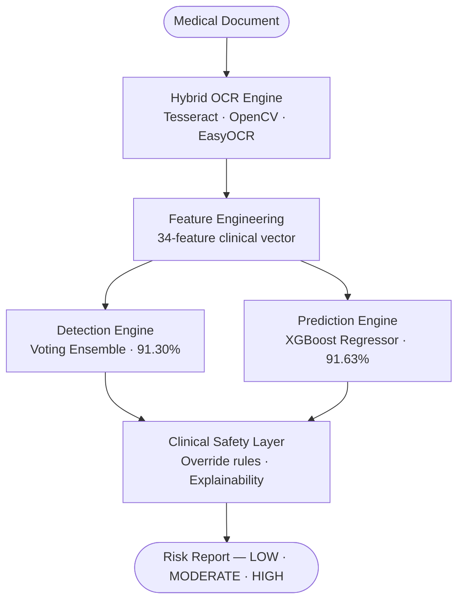
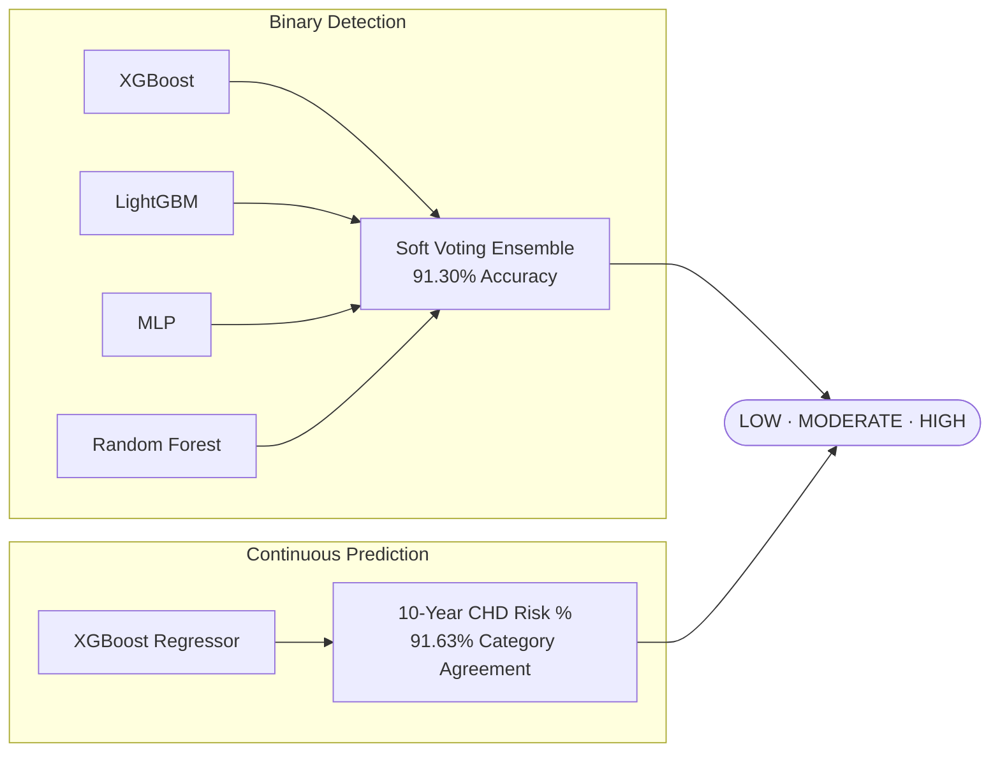
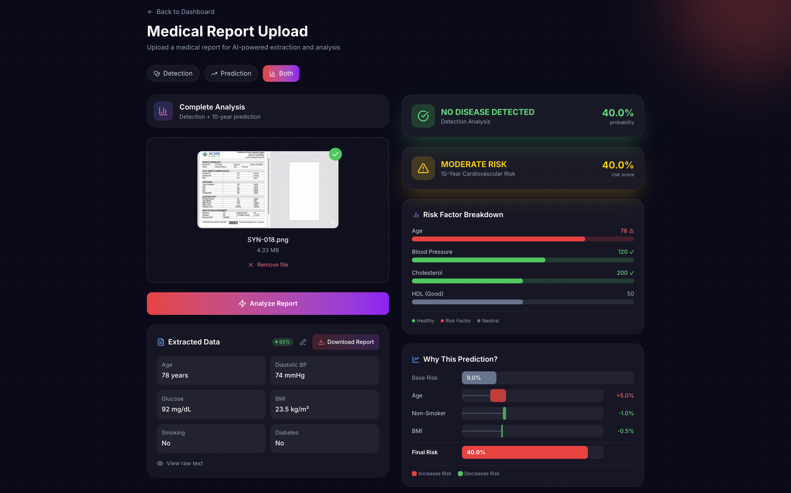

<div align="center">

<h1>CardioDetect</h1>

<p><strong>Clinical Decision Support System for Cardiovascular Risk Assessment</strong></p>

<p>
  <a href="https://python.org"></a>
  <a href="LICENSE"></a>
  <a href="https://doi.org/10.36227/techrxiv.177154153.36052407/v1"></a>
  <a href="https://orcid.org/0009-0008-3295-2950"></a>
  
</p>

<p><em>Upload a medical report and receive an automated cardiovascular risk assessment — no manual data entry required.</em></p>

</div>

---

## Overview

CardioDetect is a research-driven, production-oriented clinical decision support system that combines a **hybrid OCR pipeline** with a **dual-engine ML architecture** to assess cardiovascular risk directly from raw medical documents — PDFs, scanned images, or structured text.

The system extracts clinical parameters via multi-engine OCR, constructs a 34-feature clinical vector, runs two independently optimised ML models, applies evidence-based clinical safety rules, and returns a structured risk report with explainable contributing factors.

> **Disclaimer:** Not a substitute for professional medical diagnosis. Intended for research and clinical decision-support prototyping only.

---

## Performance

| Engine | Task | Result |
|--------|------|--------|
| Voting Ensemble (XGBoost · LightGBM · MLP · RF) | Heart disease detection | **91.30% accuracy** |
| XGBoost Regressor | 10-year CHD risk stratification | **91.63% category agreement** |
| Universal OCR Engine | Clinical field extraction | PDF · Image · Text |
| Feature pipeline | Engineered clinical vector | 34+ features |

*Evaluation performed using stratified train/test splits across merged Framingham, NHANES, and UCI datasets.*

### Validation Strategy

- **Stratified Split:** 70/15/15 (Train/Validation/Test)
- **Data Harmonization:** Cross-dataset standardisation across 3 distinct epidemiological sources
- **Evaluation:** Strict held-out evaluation on unseen test samples
- **Grounding:** Risk agreement measured directly against ACC/AHA pooled cohort clinical thresholds

---

## Architecture



### Dual-Engine Design



The dual-engine design separates binary disease detection from long-term risk prediction, enabling modular optimisation and clearer clinical interpretation. The outputs are fused through a clinical safety layer before the final classification is emitted.

---

## Quickstart

**Requirements:** Python 3.10+, Tesseract OCR

```bash
# 1. Clone and install
git clone https://github.com/Prajan-v/CardioDetect.git
cd CardioDetect
python -m venv .venv && source .venv/bin/activate
pip install -r requirements.txt
brew install tesseract        # macOS — apt install tesseract-ocr on Ubuntu

# 2. Run a prediction
python -c "
from src.cardiodetect_v3_pipeline import CardioDetectV3
result = CardioDetectV3().run('lab_report.pdf')
print(result['risk_category'], f\"{result['risk_score']*100:.1f}%\")
"
```

**Web application** (Django + Next.js):

```bash
cd Milestone_3 && python manage.py runserver      # API  → localhost:8000
cd Milestone_3/frontend && npm i && npm run dev   # UI   → localhost:3000
```

> **Reproducibility:** To reproduce training results, run the notebooks located in `Milestone_1/` and `Milestone_2/`.



---

## Output

```json
{
  "risk_category": "MODERATE",
  "risk_score": 0.327,
  "recommendation": "Moderate cardiovascular risk (32.7%). Consult a healthcare provider for risk factor management.",
  "explanations": {
    "top_reasons": [
      "Systolic blood pressure 148 mmHg is elevated.",
      "Total cholesterol 225 mg/dL is borderline high.",
      "Age 58 years contributes to elevated cardiovascular risk."
    ]
  },
  "ocr_confidence": { "average": 0.89 },
  "audit": { "engine": "tesseract_ocr", "model_version": "risk_regressor_v2" }
}
```

---

## Project Layout

```
CardioDetect/
├── Milestone_1/        EDA and data preprocessing
├── Milestone_2/        ML model development and OCR pipeline
├── Milestone_3/        Django REST backend + Next.js frontend
├── Milestone_4/        Research paper and final report
├── src/                Core library — pipeline, models, preprocessing
├── tests/              pytest test suite
├── docs/               Architecture, API reference, project structure
└── results/            Model evaluation outputs
```

Extended documentation → [`/docs`](docs/)

---

## Limitations

- Trained on publicly available epidemiological datasets; not validated in clinical deployment
- OCR field extraction quality depends on document scan resolution
- Model demographics reflect Framingham/NHANES/UCI populations and may not generalise universally

---

## Publication

CardioDetect is formally published as a preprint on **TechRxiv**, IEEE's preprint platform for technology research.

**Prajan Narayanan V** — *CardioDetect: An Integrated Clinical Decision Support System for Cardiovascular Risk Assessment Using Dual-Engine ML and Hybrid OCR Pipeline* — TechRxiv, 2026.

DOI: [10.36227/techrxiv.177154153.36052407/v1](https://doi.org/10.36227/techrxiv.177154153.36052407/v1)

---

## License

Released under the [MIT License](LICENSE).
