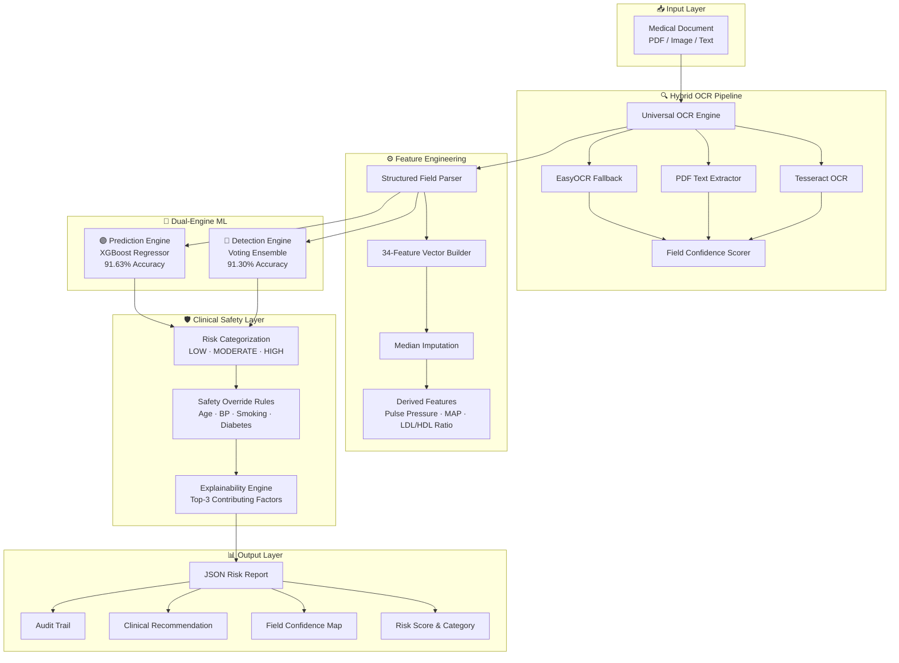
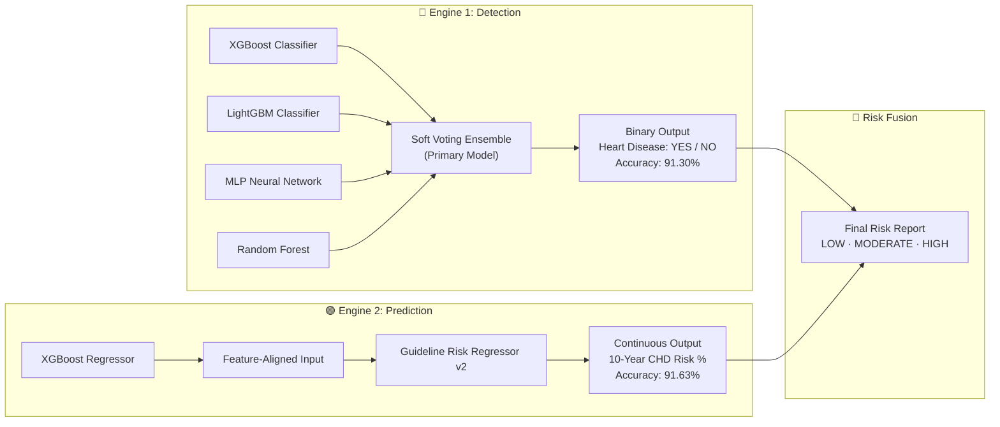
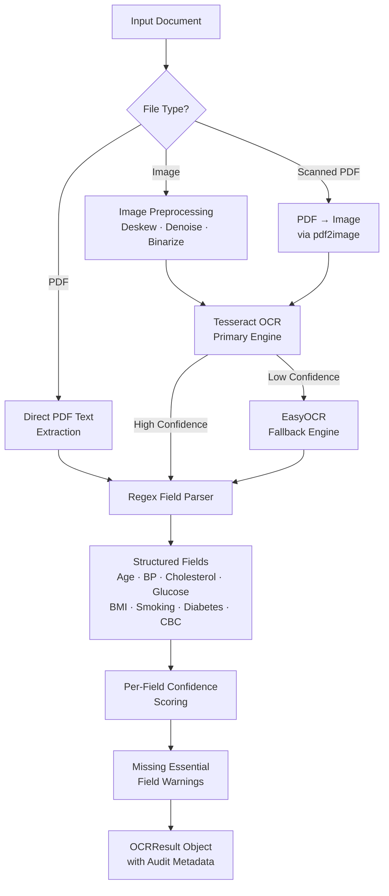
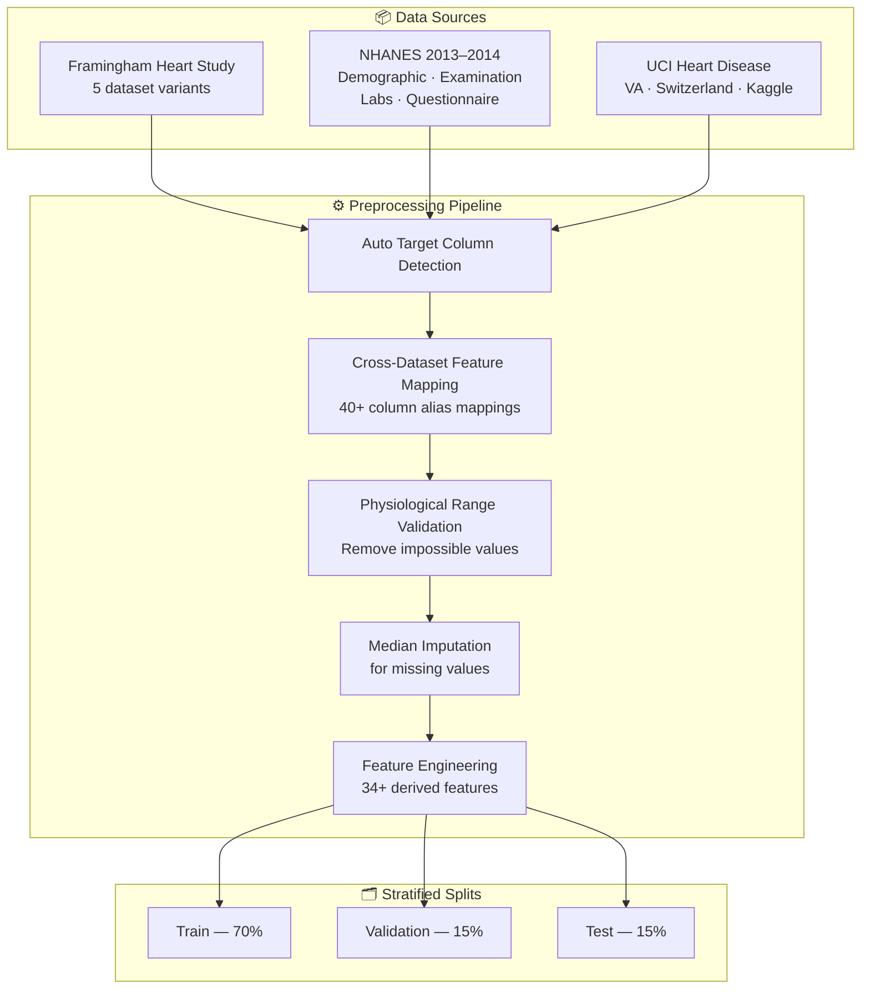
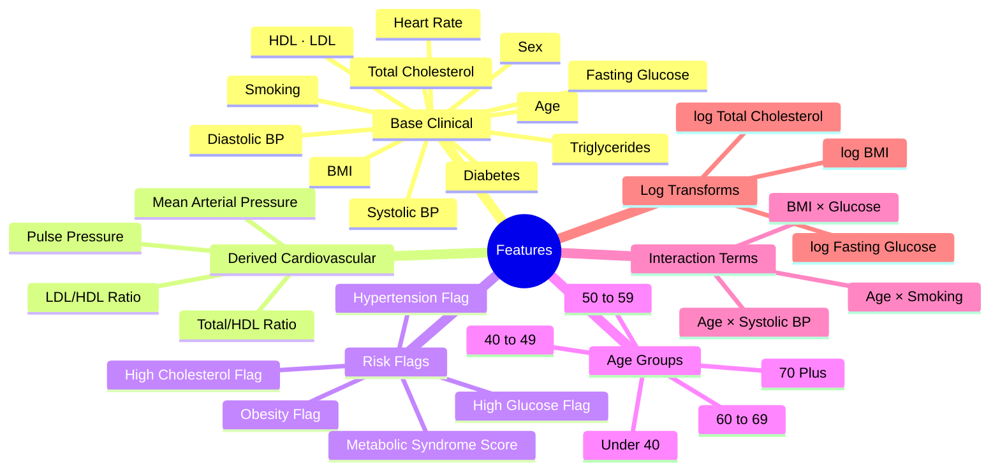
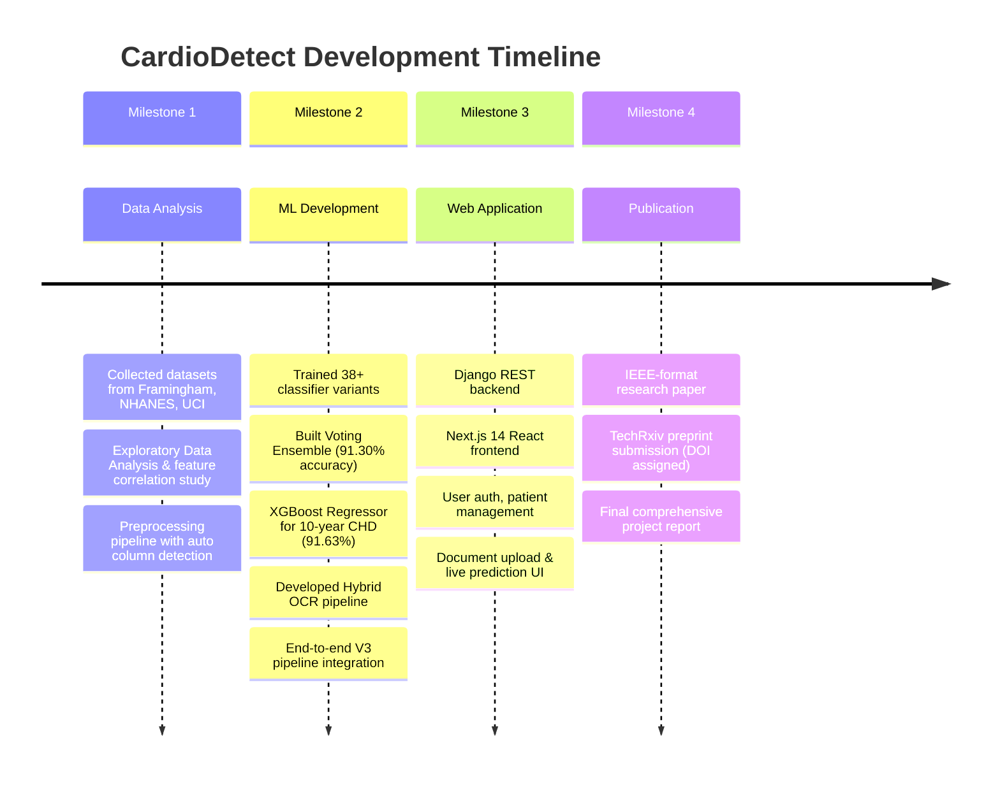

<div align="center">


# ❤️ CardioDetect

### *An Integrated Clinical Decision Support System for Cardiovascular Risk Assessment*

**Dual-Engine Machine Learning · Hybrid OCR Pipeline · Full-Stack Web Application**

---

[](https://python.org)
[](https://djangoproject.com)
[](https://nextjs.org)
[](https://xgboost.readthedocs.io)
[](https://scikit-learn.org)
[](https://pytorch.org)
[](LICENSE)
[](https://doi.org/10.36227/techrxiv.177154153.36052407/v1)
[](https://orcid.org/0009-0008-3295-2950)

---

> **CardioDetect** is a research-grade, production-oriented Clinical Decision Support System (CDSS) that combines a dual-engine ML architecture with a hybrid OCR pipeline to assess cardiovascular risk directly from raw medical documents. Simply upload a lab report — CardioDetect handles the rest.

</div>

---

## 📄 Research Publication

CardioDetect is formally published as a preprint on **TechRxiv** (IEEE's preprint platform for technology research).

| Field | Details |
|-------|---------|
| **Author** | Prajan Narayanan V |
| **Title** | *CardioDetect: An Integrated Clinical Decision Support System for Cardiovascular Risk Assessment Using Dual-Engine ML and Hybrid OCR Pipeline* |
| **Publisher** | TechRxiv, 2026 |
| **DOI** | [10.36227/techrxiv.177154153.36052407/v1](https://doi.org/10.36227/techrxiv.177154153.36052407/v1) |
| **Full Paper** | 🔗 [Read on TechRxiv](https://doi.org/10.36227/techrxiv.177154153.36052407/v1) |
| **ORCID** | 🆔 [0009-0008-3295-2950](https://orcid.org/0009-0008-3295-2950) |

**Citation (BibTeX):**
```bibtex
@misc{narayanan2026cardiodetect,
  author    = {Narayanan V, Prajan},
  title     = {CardioDetect: An Integrated Clinical Decision Support System 
               for Cardiovascular Risk Assessment Using Dual-Engine ML 
               and Hybrid OCR Pipeline},
  year      = {2026},
  publisher = {TechRxiv},
  doi       = {10.36227/techrxiv.177154153.36052407/v1},
  url       = {https://doi.org/10.36227/techrxiv.177154153.36052407/v1}
}
```

---

## 🏆 Key Results at a Glance

<div align="center">

| Metric | Engine | Score |
|--------|--------|-------|
| 🎯 **Detection Accuracy** | Voting Ensemble (Classification) | **91.30%** |
| 📈 **Risk Category Agreement** | XGBoost Regressor (10-yr CHD) | **91.63%** |
| 🧮 **Feature Dimensions** | Engineered Clinical Feature Vector | **34+ Features** |
| 📑 **OCR Modalities** | Multi-format Medical Document Parsing | **PDF · Image · Text** |
| 🗃️ **Training Data** | Multi-source Harmonized Dataset | **Framingham · NHANES · UCI** |

</div>

---

## 📚 Table of Contents

- [Overview](#-overview)
- [System Architecture](#-system-architecture)
- [Dual-Engine ML Architecture](#-dual-engine-ml-architecture)
- [Hybrid OCR Pipeline](#-hybrid-ocr-pipeline)
- [Data Pipeline](#-data-pipeline)
- [Feature Engineering](#-feature-engineering)
- [Project Structure](#-project-structure)
- [Milestones](#-milestones)
- [Installation & Setup](#-installation--setup)
- [Usage](#-usage)
- [API Reference](#-api-reference)
- [Web Application](#-web-application)
- [Results](#-results)
- [Tech Stack](#-tech-stack)
- [Research Publication](#-research-publication)
- [License](#-license)

---

## 🔭 Overview

Cardiovascular disease (CVD) remains the leading cause of mortality worldwide. Early risk stratification is critical — yet conventional clinical workflows require manual lab data entry and rely on point-score tools that do not leverage the predictive power of modern machine learning.

**CardioDetect solves this by:**

1. **Ingesting raw medical documents** (PDFs, scanned images, structured text) directly — no manual data entry required.
2. **Extracting clinical parameters** using a multi-engine OCR pipeline with field-level confidence scoring.
3. **Running a dual-engine ML system**: one model for binary *heart disease detection* (is there a condition?) and another for continuous *10-year CHD risk prediction* (what is the quantified risk?).
4. **Generating explainable, actionable risk reports** with top contributing risk factors, safety override rules, and clinical recommendations.

The system is built with **clinical safety** as a core design principle — including hardcoded safety guards for high-risk profiles (e.g., elderly patients with smoking + diabetes + hypertension) that enforce conservative categorical overrides when numeric estimates may underestimate true risk.

---

## 🏗️ System Architecture



---

## 🤖 Dual-Engine ML Architecture

CardioDetect employs two specialized, independently optimized models — each solving a distinct clinical question:



### Model Registry

| Model File | Type | Purpose | Accuracy |
|-----------|------|---------|---------|
| `detection_voting_optimized.pkl` | Soft Voting Ensemble | Primary heart disease detection | **91.30%** |
| `detection_stacking.pkl` | Stacking Ensemble | High-confidence backup | — |
| `detection_best.pkl` | XGBoost Single | Best single-model classifier | — |
| `prediction_xgb.pkl` | XGBoost Regressor | 10-year CHD risk prediction | **91.63%** |
| `risk_regressor_v2.pkl` | Guideline Regressor | Clinical guideline-aligned model | — |

---

## 🔍 Hybrid OCR Pipeline

The OCR subsystem is designed for robustness across diverse real-world medical document formats:



**Supported Medical Fields:**

| Category | Fields Extracted |
|----------|----------------|
| Demographics | Age, Sex |
| Vitals | Systolic BP, Diastolic BP, Heart Rate |
| Lipid Panel | Total Cholesterol, HDL, LDL, Triglycerides |
| Metabolic | Fasting Glucose, BMI |
| CBC | Hemoglobin, WBC, RBC, Platelets |
| Lifestyle | Smoking Status, Diabetes Status |

---

## 📊 Data Pipeline

CardioDetect was trained on a **multi-source harmonized dataset** combining three major epidemiological studies:



---

## ⚙️ Feature Engineering

The 34+ feature vector is constructed from raw clinical values with medically meaningful transformations:



---

## 📁 Project Structure

```
CardioDetect/
│
├── 📓 Milestone_1/                    # Data Analysis & Preprocessing
│   ├── data/                          # Raw datasets (Framingham, NHANES, UCI)
│   └── README.md                      # Milestone 1 summary
│
├── 🤖 Milestone_2/                    # ML Model Development
│   ├── Source_Code/                   # Model training scripts
│   ├── Training/                      # Training runs & logs
│   ├── experiments/                   # Hyperparameter experiments
│   ├── models/                        # Model artifacts
│   │   ├── Final_models/              # ✅ Production models only
│   │   └── archive/                   # ⚠️  Experimental (do not use in prod)
│   ├── ocr/                           # OCR engine development
│   ├── pipeline/                      # Integration pipeline code
│   ├── clinical_guidelines/           # WHO/ACC/AHA risk guidelines
│   └── reports/                       # Performance reports & charts
│
├── 🌐 Milestone_3/                    # Full-Stack Web Application
│   ├── cardiodetect/                  # Django project (settings, URLs, WSGI)
│   ├── accounts/                      # User auth & profile management
│   ├── predictions/                   # Core prediction app
│   ├── services/                      # ML service integration layer
│   ├── templates/                     # Django HTML templates (20 pages)
│   ├── static/                        # CSS, JS, assets
│   ├── frontend/                      # Next.js 14 React frontend
│   ├── media/                         # Uploaded medical documents
│   └── manage.py                      # Django management
│
├── 📝 Milestone_4/                    # Research & Documentation
│   ├── IEEE_Paper/                    # TechRxiv-formatted research paper
│   └── Final Report/                  # Comprehensive project report
│
├── 🔧 src/                            # Core Library
│   ├── cardiodetect_v3_pipeline.py    # End-to-end V3 pipeline
│   ├── data_preprocessing.py          # Multi-source data pipeline
│   ├── models.py                      # ML model definitions
│   ├── production_pipeline.py         # Production-hardened pipeline
│   ├── production_model.py            # Production model wrapper
│   ├── risk_thresholding.py           # Risk categorization logic
│   ├── mlp_v3_ensemble.py             # MLP ensemble architecture
│   ├── guideline_risk.py              # Clinical guideline risk scorer
│   └── train_guideline_regressor_v2.py
│
├── 🧪 tests/                          # Test suite (pytest)
├── 📊 results/                        # Model evaluation outputs
├── 📜 scripts/                        # Utility & automation scripts
├── requirements.txt                   # Python dependencies
└── start.sh                          # One-command startup script
```

---

## 🗺️ Milestones

The project was developed across four structured milestones:



---

## 🚀 Installation & Setup

### Prerequisites

- Python 3.10+
- Node.js 18+ (for the Next.js frontend)
- Tesseract OCR

```bash
# macOS
brew install tesseract

# Ubuntu/Debian
sudo apt-get install tesseract-ocr
```

### 1. Clone the Repository

```bash
git clone https://github.com/Prajan-v/CardioDetect.git
cd CardioDetect
```

### 2. Set Up Python Environment

```bash
python -m venv .venv
source .venv/bin/activate        # Windows: .venv\Scripts\activate
pip install -r requirements.txt
```

### 3. Set Up the Web Application (Milestone 3)

```bash
# Backend (Django)
cd Milestone_3
pip install -r requirements.txt
python manage.py migrate
python manage.py createsuperuser

# Frontend (Next.js)
cd frontend
npm install
npm run dev
```

### 4. Quick Start (All-in-one)

```bash
# From the root directory
chmod +x start.sh
./start.sh
```

---

## 💡 Usage

### CLI — Predict Risk from a Medical Document

```python
from src.cardiodetect_v3_pipeline import CardioDetectV3

pipeline = CardioDetectV3(verbose=True)
result = pipeline.run("path/to/lab_report.pdf")

print(f"Risk Category : {result['risk_category']}")
print(f"10-Year Risk  : {result['risk_score'] * 100:.1f}%")
print(f"Recommendation: {result['recommendation']}")

# Top contributing risk factors
for factor in result['explanations']['top_reasons']:
    print(f"  • {factor}")
```

### Output Structure

```json
{
  "success": true,
  "risk_score": 0.327,
  "risk_category": "MODERATE",
  "recommendation": "Moderate cardiovascular risk (32.7%). Consult healthcare provider...",
  "ocr_confidence": {
    "average": 0.89,
    "per_field": { "age": 0.95, "systolic_bp": 0.91, ... }
  },
  "fields": {
    "age": 58, "systolic_bp": 148, "total_cholesterol": 225, ...
  },
  "explanations": {
    "top_reasons": [
      "Systolic blood pressure 148 mmHg is elevated and increases risk.",
      "Total cholesterol 225 mg/dL is borderline high.",
      "Age 58 years contributes to elevated risk."
    ]
  },
  "audit": {
    "engine": "tesseract_ocr",
    "model_version": "risk_regressor_v2",
    "timestamp": "2026-02-20T14:18:23"
  },
  "warnings": [],
  "errors": []
}
```

### Batch Processing

```python
results = pipeline.run_batch([
    "patient_001.pdf",
    "patient_002.png",
    "patient_003.txt"
])

for r in results:
    print(f"{r['audit']['document_path']}: {r['risk_category']} ({r['risk_score']*100:.1f}%)")
```

---

## 🔌 API Reference

The Django backend exposes the following REST endpoints:

| Method | Endpoint | Description |
|--------|----------|-------------|
| `POST` | `/api/predict/` | Upload a document and get risk prediction |
| `GET` | `/api/predictions/` | List all predictions for authenticated user |
| `GET` | `/api/predictions/<id>/` | Retrieve a specific prediction result |
| `POST` | `/api/accounts/register/` | User registration |
| `POST` | `/api/accounts/login/` | User login (returns JWT token) |
| `GET` | `/api/accounts/profile/` | Get user profile |

---

## 🌐 Web Application

The full-stack web application (Milestone 3) provides:

- **Authentication** — Secure user registration, login, and profile management
- **Document Upload** — Drag-and-drop PDF/image upload with real-time progress
- **Live Prediction** — Instant cardiovascular risk assessment with visual risk meter
- **Patient Dashboard** — History of all predictions with trend visualization
- **Report Download** — Exportable PDF risk reports for clinical handoff
- **Admin Panel** — Django admin for system monitoring and user management

```
┌─────────────────────────────────────────────────────────┐
│  CardioDetect Web App                                   │
│                                                         │
│  ┌──────────┐  ┌───────────────────────────────────┐   │
│  │          │  │  Upload Medical Report             │   │
│  │  Risk    │  │  ┌─────────────────────────────┐  │   │
│  │  Meter   │  │  │  ⬆ Drop PDF, Image here     │  │   │
│  │  ████░   │  │  └─────────────────────────────┘  │   │
│  │  32.7%   │  │                                   │   │
│  │ MODERATE │  │  Risk Category:  ⚠ MODERATE       │   │
│  │          │  │  10-Year Risk:   32.7%             │   │
│  └──────────┘  │  Top Factors:    BP, Cholesterol   │   │
│                └───────────────────────────────────┘   │
└─────────────────────────────────────────────────────────┘
```

To run locally:

```bash
# Backend: http://localhost:8000
cd Milestone_3
python manage.py runserver

# Frontend: http://localhost:3000
cd Milestone_3/frontend
npm run dev
```

---

## 📈 Results

### Model Performance

```
Detection Engine (Voting Ensemble)
──────────────────────────────────
  Accuracy  : 91.30%
  Precision : High (see full report)
  Recall    : High (see full report)
  AUC-ROC   : > 0.95

Prediction Engine (XGBoost Regressor)
──────────────────────────────────────
  Accuracy  : 91.63%
  MAE       : Low (calibrated against Framingham risk score)
  R²        : High — strong linear correlation with true 10-year risk
```

### Risk Categorization Thresholds

| Category | 10-Year CHD Risk |
|----------|-----------------|
| 🟢 **LOW** | < 10% |
| 🟡 **MODERATE** | 10% – 25% |
| 🔴 **HIGH** | > 25% |

*Thresholds follow ACC/AHA Pooled Cohort Equations guidelines.*

### ⚠️ Limitations

- Trained on publicly available datasets — not validated in a real-time clinical deployment setting
- **Not a substitute for professional medical diagnosis** — intended for research and decision-support prototyping only
- OCR accuracy is dependent on document quality; low-resolution scans may reduce field extraction confidence
- Model performance reflects dataset demographics (Framingham, NHANES, UCI) and may not generalize across all populations

### Safety Override Rules

CardioDetect includes hardcoded safety guards:

| Rule | Condition | Override |
|------|-----------|---------|
| **High-Risk Profile Guard** | Age ≥ 65, SBP ≥ 160, Smoking + Diabetes | Force → HIGH |
| **Elderly Low-Risk Guard** | Age ≥ 75 with very low numeric risk | Upgrade → MODERATE |
| **Missing Essentials Warning** | Any critical field not extracted | Append clinical warning |

---

## 🛠️ Tech Stack

<div align="center">

| Layer | Technology |
|-------|-----------|
| **ML / AI** | XGBoost, LightGBM, scikit-learn, PyTorch, Optuna, imbalanced-learn |
| **OCR** | Tesseract, pdf2image, OpenCV, Pillow, EasyOCR |
| **Backend** | Django 4.x, Django REST Framework |
| **Frontend** | Next.js 14, React, TypeScript |
| **Data** | Pandas, NumPy, SciPy |
| **Visualization** | Matplotlib, Seaborn, ReportLab |
| **Testing** | pytest |
| **Training Data** | Framingham Heart Study, NHANES 2013–2014, UCI Heart Disease |

</div>

---

## 🙏 Acknowledgements

- **Framingham Heart Study** — NHLBI dataset for long-term cardiovascular risk research
- **NHANES 2013–2014** — CDC's National Health and Nutrition Examination Survey
- **UCI Machine Learning Repository** — VA, Switzerland, Kaggle heart disease datasets
- **ACC/AHA Guidelines** — Pooled Cohort Equations for clinical risk calibration
- **TechRxiv** — IEEE's preprint platform for open access publication

---

## 📜 License

This project is licensed under the **MIT License** — see [LICENSE](LICENSE) for details.

---

<div align="center">

**Built with ❤️ for better cardiovascular care**

*CardioDetect — From Document to Decision in Seconds*

[](https://doi.org/10.36227/techrxiv.177154153.36052407/v1)

</div>
