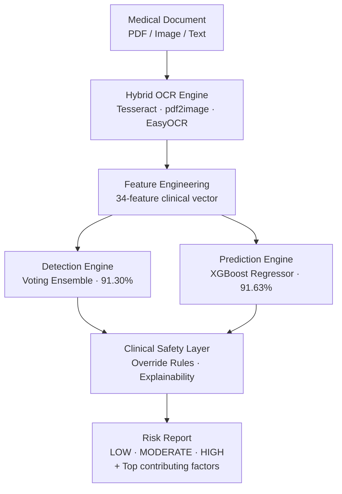
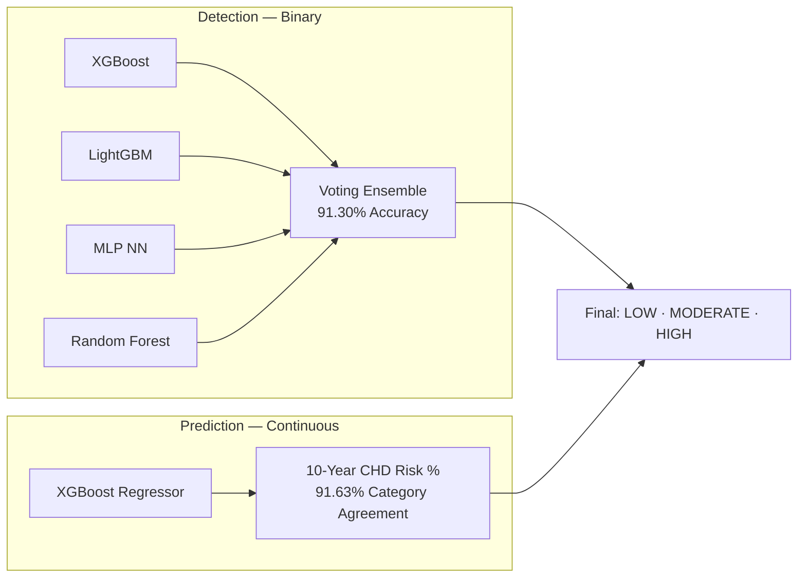

<div align="center">

# ❤️ CardioDetect

### *Clinical Decision Support System for Cardiovascular Risk Assessment*

[](https://python.org)
[](LICENSE)
[](https://doi.org/10.36227/techrxiv.177154153.36052407/v1)
[](https://orcid.org/0009-0008-3295-2950)

</div>

---

CardioDetect is a research-driven, production-oriented CDSS that assesses cardiovascular risk directly from raw medical documents — no manual data entry. Upload a PDF or image lab report; the system extracts clinical parameters via a hybrid OCR pipeline, feeds them into a dual-engine ML model, and returns a categorized risk report with explainable contributing factors.

> ⚠️ Not a substitute for professional medical diagnosis. Designed for research and decision-support prototyping.

---

## 🏆 Results

| Metric | Value |
|--------|-------|
| Heart Disease Detection Accuracy | **91.30%** (Voting Ensemble) |
| 10-Year CHD Risk Category Agreement | **91.63%** (XGBoost Regressor) |
| Feature Vector Dimensions | **34+** engineered clinical features |
| OCR Input Formats | PDF · Scanned Image · Structured Text |
| Training Data | Framingham · NHANES 2013–14 · UCI Heart Disease |

---

## 🏗️ System Architecture



---

## 🤖 Dual-Engine ML



---

## 🚀 Installation

```bash
git clone https://github.com/Prajan-v/CardioDetect.git
cd CardioDetect
python -m venv .venv && source .venv/bin/activate
pip install -r requirements.txt

# Tesseract OCR (macOS)
brew install tesseract
```

---

## 💡 Usage

```python
from src.cardiodetect_v3_pipeline import CardioDetectV3

pipeline = CardioDetectV3()
result = pipeline.run("lab_report.pdf")

print(result["risk_category"])       # LOW | MODERATE | HIGH
print(result["risk_score"] * 100)    # e.g. 32.7
print(result["recommendation"])
for reason in result["explanations"]["top_reasons"]:
    print(f"  • {reason}")
```

**Web app** — Django backend + Next.js frontend:

```bash
cd Milestone_3 && python manage.py runserver   # http://localhost:8000
cd Milestone_3/frontend && npm install && npm run dev  # http://localhost:3000
```

---

## 📄 Research Publication

CardioDetect is formally published as a preprint on TechRxiv (IEEE's preprint platform for technology research).

**Prajan Narayanan V**,
*CardioDetect: An Integrated Clinical Decision Support System for Cardiovascular Risk Assessment Using Dual-Engine ML and Hybrid OCR Pipeline*,
TechRxiv, 2026.
DOI: [10.36227/techrxiv.177154153.36052407/v1](https://doi.org/10.36227/techrxiv.177154153.36052407/v1)

```bibtex
@misc{narayanan2026cardiodetect,
  author    = {Narayanan V, Prajan},
  title     = {CardioDetect: An Integrated Clinical Decision Support System
               for Cardiovascular Risk Assessment Using Dual-Engine ML
               and Hybrid OCR Pipeline},
  year      = {2026},
  publisher = {TechRxiv},
  doi       = {10.36227/techrxiv.177154153.36052407/v1}
}
```

---

## 📁 Project Structure

```
CardioDetect/
├── Milestone_1/   # EDA & data preprocessing
├── Milestone_2/   # ML model development & OCR pipeline
├── Milestone_3/   # Django + Next.js web application
├── Milestone_4/   # Research paper & final report
├── src/           # Core library (pipeline, models, OCR, preprocessing)
├── tests/         # pytest test suite
└── results/       # Model evaluation outputs
```

> Detailed structure, API reference, architecture deep-dives, and data pipeline docs → [`/docs`](docs/)

---

## ⚠️ Limitations

- Trained on publicly available datasets — not validated in real-time clinical deployment
- OCR accuracy depends on document scan quality
- Model reflects Framingham/NHANES/UCI demographics; may not generalize to all populations

---

## 📜 License

MIT — see [LICENSE](LICENSE).

---

<div align="center">
<sub>Built for better cardiovascular care · <a href="https://doi.org/10.36227/techrxiv.177154153.36052407/v1">Read the paper</a></sub>
</div>
