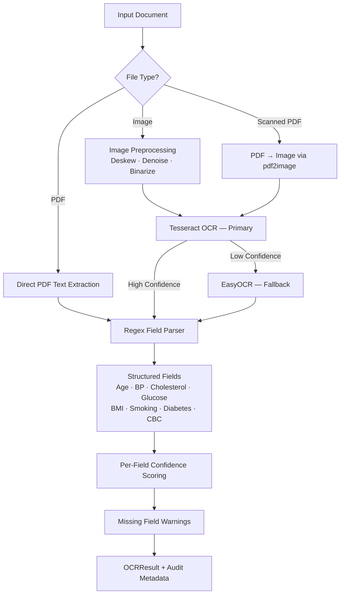
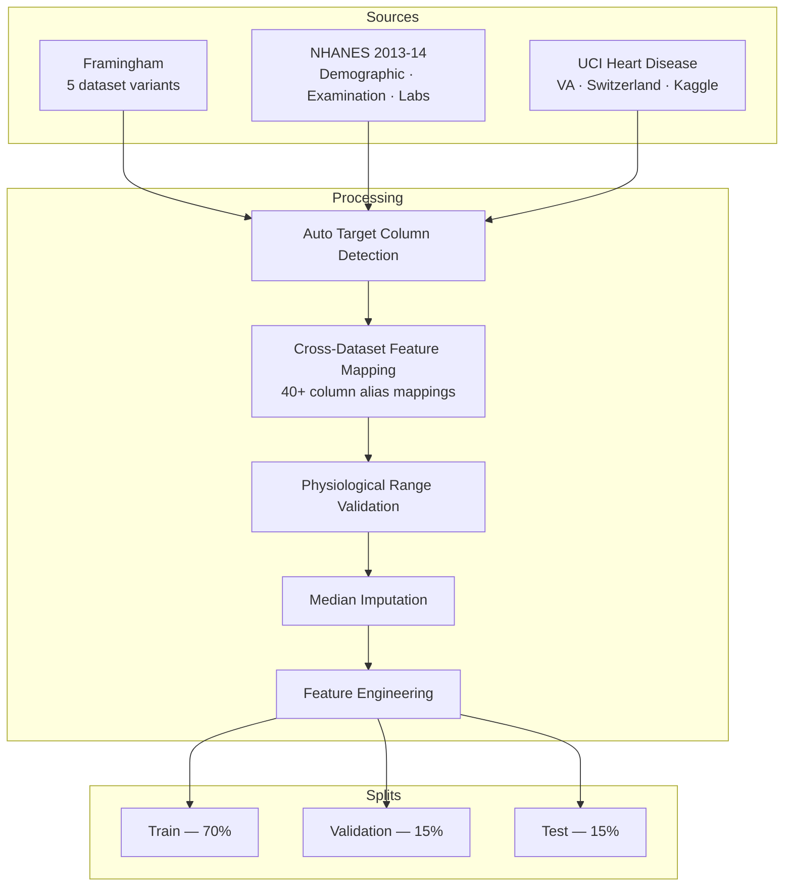

# CardioDetect — Architecture Deep Dive

> Full technical architecture for the system. See the [main README](../README.md) for a high-level overview.

---

## Hybrid OCR Pipeline

**Supported fields:**

| Category | Fields |
|----------|--------|
| Demographics | Age, Sex |
| Vitals | Systolic BP, Diastolic BP, Heart Rate |
| Lipid Panel | Total Cholesterol, HDL, LDL, Triglycerides |
| Metabolic | Fasting Glucose, BMI |
| CBC | Hemoglobin, WBC, RBC, Platelets |
| Lifestyle | Smoking Status, Diabetes Status |

---

## Data Pipeline

---

## Feature Engineering (34+ Features)

From raw clinical values, the pipeline derives the following:

| Category | Features |
|----------|---------|
| **Base Clinical** | Age, Sex, Systolic/Diastolic BP, Cholesterol (Total/HDL/LDL), Triglycerides, Fasting Glucose, BMI, Heart Rate, Smoking, Diabetes |
| **Derived Cardiovascular** | Pulse Pressure, Mean Arterial Pressure, LDL/HDL Ratio, Total/HDL Ratio |
| **Risk Flags** | Hypertension Flag, High Cholesterol Flag, High Glucose Flag, Obesity Flag, Metabolic Syndrome Score |
| **Age Groups (one-hot)** | <40, 40–49, 50–59, 60–69, 70+ |
| **Interaction Terms** | Age × Systolic BP, BMI × Glucose, Age × Smoking |
| **Log Transforms** | log(Total Cholesterol), log(Fasting Glucose), log(BMI) |

---

## Clinical Safety Override Rules

| Rule | Trigger | Effect |
|------|---------|--------|
| High-Risk Profile Guard | Age ≥ 65 + SBP ≥ 160 + Smoking + Diabetes | Force category → HIGH |
| Elderly Low-Risk Guard | Age ≥ 75 with very low numeric score | Upgrade → MODERATE |
| Missing Essentials Warning | Any critical field not extracted by OCR | Append clinical warning to output |

---

## Development Timeline

| Milestone | Deliverable |
|-----------|-------------|
| **M1** | EDA, multi-source data collection, preprocessing pipeline |
| **M2** | 38+ model variants trained, Voting Ensemble + XGBoost Regressor finalized, OCR engine built, V3 end-to-end pipeline |
| **M3** | Django REST backend + Next.js 14 frontend, user auth, prediction UI |
| **M4** | TechRxiv preprint publication, final comprehensive report |
